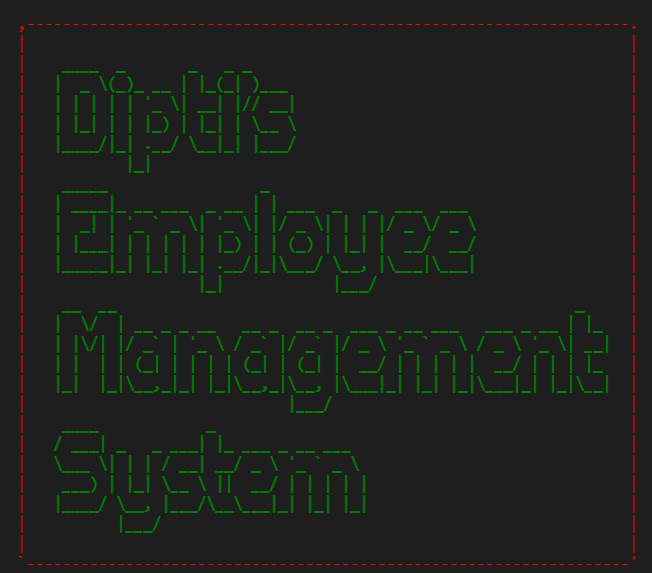
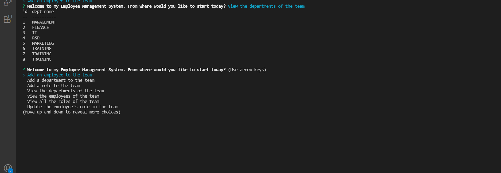
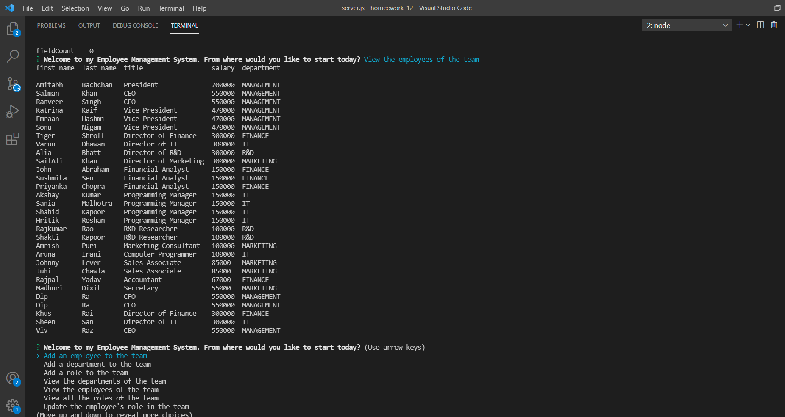
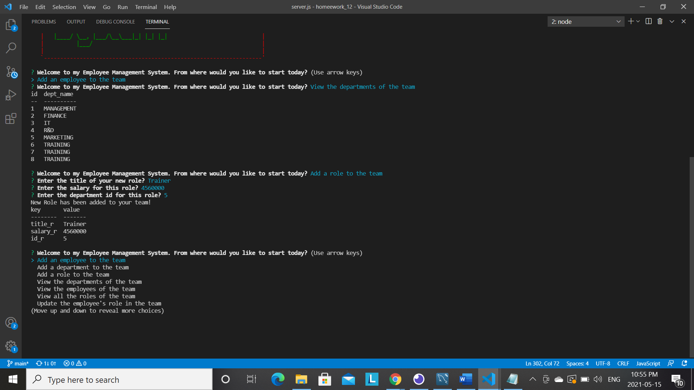
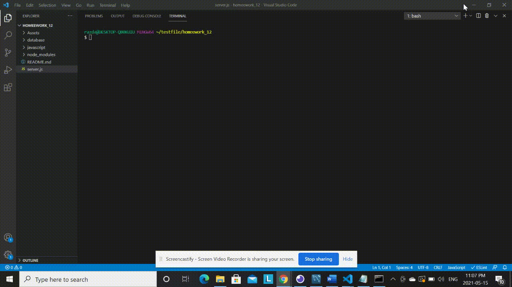

# Employee Tracker


My challenge was to architect and build a solution for managing a company's employees using node, inquirer, and MySQL.
## Table of Contents
* [Introduction](#introduction)
* [Screenshots of the App](#scr)
* [Demo of the Application](#demo)
* [Deployed Application](#web)
* [Installations](#installations)
* [Questions](#ques)
* [Credits](#credits)

 ## Introduction 
 Employee-Management-System is a __C__ ontent __M__ anagement __S__ ystem that stores the user's information in MySQL. This application is used for managing a company's employee data using Node.js, inquirer, and CRUD operations. Along with it, being a complete back end project, I added ascii art to create an introductort logo and used require module to present the output in a _Tabular form_. Also, you can run the Database in My SQL Workbench and see the same results in 2 different environments.
 In order to run the code, a lot of __npm__ commands needs to be run and the installation are as shown 
  ```
npm install
```

 ```
npm install inquirer
```

 ```
npm install mysql
```

 ```
npm install console.table
```

 ```
npm install ascii-art

```

 ## Screenshot of the App
 
 __Here are some screenshots taken which I got while running different functions of the code__
 
 
 
  
  
 
  
  
  
  
  
  
 
 ## Demo of the App
 A demo of the app has been uploaded as a gif
 
 
 You can also view the same code as a video by clicking on [this Youtube link](https://www.youtube.com/watch?v=aktnRELpJv0)

 

 
 ## Installations
 Attached is the Github repo for the code
   * [The URL of the Github repo](https://github.com/Dipti2021/Employee_Management_System_DR)
   

 ## Questions
In case of any questions, contact me through any of the following methods:
 * If you want you can [open an issue](https://github.com/Dipti2021/NotesTaker_DR/issues) and let me know about it.


    
 ## Credits
    The homework has been assigned to me by the Carleton University Coding Bootcamp, our instructor and the TA's

